# TheSoul Group — Аналитика контента

**Дмитрий Протасов** | Март 2026

6 инсайтов из анализа 11 500 видео на YouTube, Facebook и Snapchat

---

# Данные: что у нас есть

**3 датасета**, реальные production-данные (ID анонимизированы).

---

# Dataset 1 — Video Performance (11 500 видео)

Одна строка = одно видео. **22 колонки** — основная таблица:
- **Идентификаторы:** video_id, channel_id, platform, video_type
- **Просмотры:** total_views, first_7d_views, first_30d_views
- **Watch time:** watch_time_minutes (+ 7d, 30d)
- **Вовлечённость:** likes, dislikes, comments, shares, engagement_rate
- **Монетизация:** ad_impressions, estimated_cpm
- **Удержание:** avg_view_duration_seconds, avg_percentage_viewed

| video_id | channel_id | platform | video_type | duration_s | total_views | watch_time_min | engage_rate | est_cpm |
|:---------|:-----------|:---------|:-----------|---:|---:|---:|---:|---:|
| vid_1129600 | channel_6357 | YouTube | Production | 260 | 2 | 1 | 0.00 | 0.00 |
| vid_1129712 | channel_11257 | YouTube | Live | — | 618 | 1 341 | 2.10 | 2.51 |
| vid_1127700 | channel_11257 | YouTube | Live | — | 5 569 | 31 616 | 0.34 | 3.54 |
| vid_1127705 | channel_9356 | YouTube | Production | 247 | 2 | 0 | 0.00 | 0.00 |
| vid_1131233 | channel_8327 | YouTube | Live | — | 202 | 255 | 0.00 | 0.00 |

**Расчётная выручка:** `revenue ≈ total_views × estimated_cpm / 1000`

---

# Dataset 2 — Cohort Analysis (31 500 строк)

Одна строка = одно видео × один календарный месяц. Lifecycle видео: как набираются просмотры помесячно.

| video_id | platform | publish_month | data_month | months_since_publish | views | watch_time_min |
|:---------|:---------|:--------------|:-----------|---:|---:|---:|
| vid_1121116 | YouTube | 2025-09 | 2025-10 | 1 | 8 | 59 |
| vid_1121116 | YouTube | 2025-09 | 2025-11 | 2 | 7 | 38 |
| vid_1121116 | YouTube | 2025-09 | 2025-12 | 3 | 4 | 21 |
| vid_1121116 | YouTube | 2025-09 | 2026-01 | 4 | 2 | 0 |
| vid_1121116 | YouTube | 2025-09 | 2026-02 | 5 | 1 | 1 |

↑ Видно как просмотры затухают по месяцам. Evergreen-видео — те, где этого затухания нет.

---

# Dataset 3 — Cross-Platform (26 000 строк)

Кросс-платформенные связки: один контент (`content_original_id`) → несколько платформ.

| video_id | content_original_id | platform | publish_date | total_views | watch_time_min |
|:---------|:--------------------|:---------|:-------------|---:|---:|
| vid_1126222 | vid_009759 | Snapchat | 2025-11-08 | 11 776 | 1 338 |
| vid_1123721 | vid_009759 | Facebook | 2025-12-01 | 16 493 | 11 142 |

↑ Один и тот же контент (vid_009759) залит на Snapchat и Facebook — можно сравнивать эффект кросс-постинга.

---

# Как устроена монетизация

TheSoul зарабатывает на рекламе, которую платформы показывают зрителям. YouTube, Facebook и Snapchat платят за каждую тысячу просмотров — эта ставка называется CPM. Чем больше просмотров и чем выше CPM — тем больше денег.

CPM сильно зависит от формата. В длинном видео (от 8 минут) YouTube вставляет рекламу в середину ролика — и готов платить за это в десятки раз больше. В Shorts рекламу некуда вставить — ролик длится 15-30 секунд, и CPM составляет доли цента.

В наших данных 91.7% выручки приходится на Snapchat Stories за счёт огромных объёмов просмотров. Но стратегические решения о контенте (какой формат снимать, какой длины, когда публиковать на другие площадки) принимаются на YouTube и Facebook. Выручка Snapchat следует за контент-стратегией, поэтому большинство инсайтов — про YouTube и Facebook.

**Данные:** 11 500 видео, 31 600 когортных записей, 26 000 записей о кросс-платформенных публикациях.

---

# EDA: Обзор данных

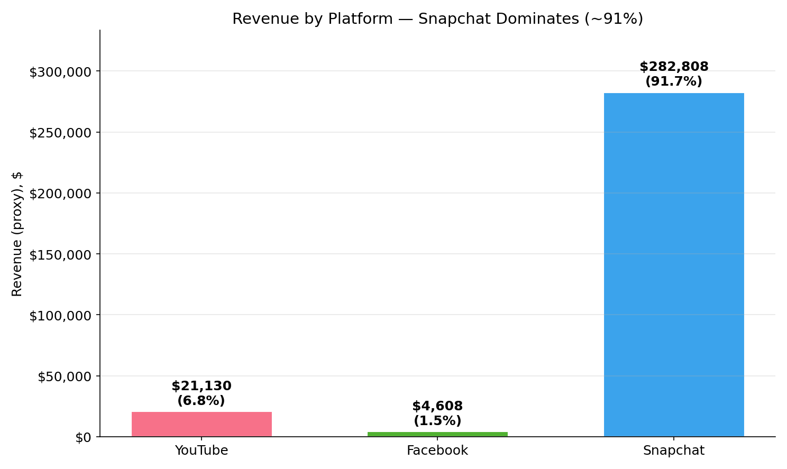 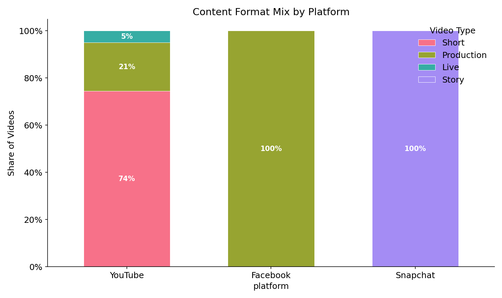

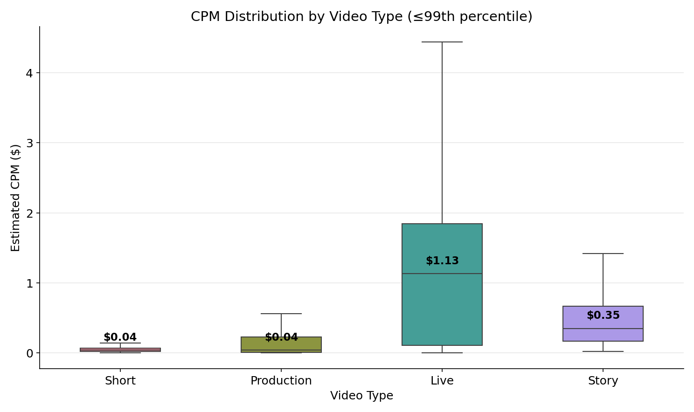 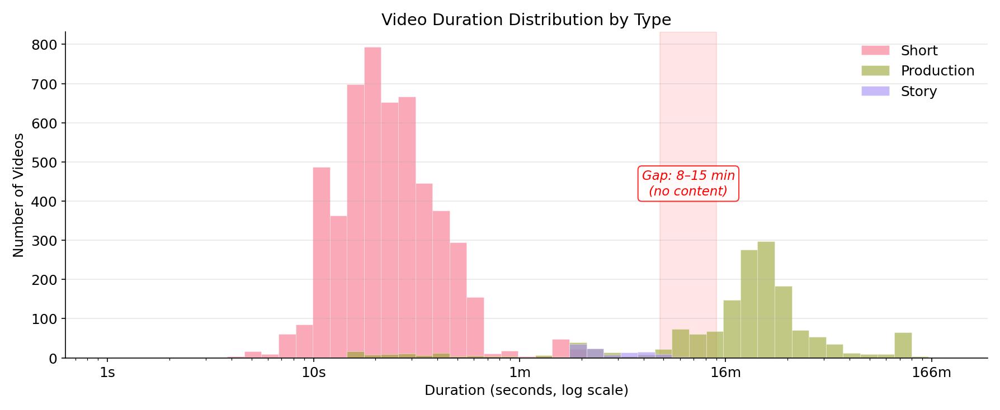

---

# Инсайт 1: Shorts эффективнее, чем кажется

Стандартный взгляд: Shorts платят $0.06 за 1000 просмотров, обычные видео — $1.94. Разница в 35 раз. Значит Shorts — пустая трата ресурсов?

Нет, если учесть стоимость производства. Обычное видео в среднем длится 30 минут, Short — 27 секунд. Если взять длительность контента как приблизительную оценку затрат на производство, картина переворачивается.

**Выручка на час произведённого контента:**

| Формат | Выручка | Часы контента | Выручка / час |
|--------|--------:|:-------------:|:-------------:|
| Shorts | $6 603 | 39 часов | **$167/час** |
| Production | $13 967 | 718 часов | **$19/час** |

Shorts приносят в **8.6 раз больше выручки на единицу произведённого контента.**

При реалистичном соотношении затрат (Production стоит в 3-5 раз дороже, чем Short) Production всё ещё выгоднее по абсолютному ROI. Но при пропорции 7.6 и выше — Shorts побеждают. Реальные затраты на производство нужно уточнять с командами.

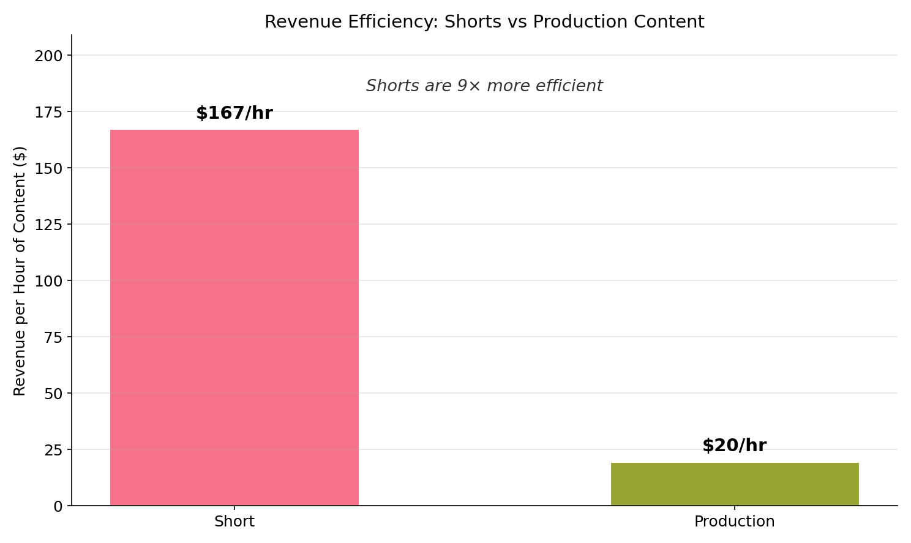

---

# Инсайт 1: Какие Shorts работают лучше

Не все Shorts одинаковы. Топ-10% Shorts зарабатывают столько же, сколько средний Production ролик. Есть три чётких паттерна:

**По длительности:** чем длиннее Short, тем выше выручка. Shorts длиной 45-60 секунд приносят в 3.6 раза больше, чем самые популярные 15-30 секундные.

⚠️ *Оговорка:* длинный Short может стоить дороже в производстве. Без данных о реальных затратах нельзя утверждать, что ROI пропорционально выше. Однако разница в затратах между 15с и 45с Short'ом вряд ли составляет 3.6× — нужна валидация с продакшн-командой.

| Длительность | Доля контента | Средняя выручка | Средние просмотры |
|:------------:|:-------------:|:---------------:|:-----------------:|
| 0-15 сек | 24% | $1.22 | 34 815 |
| 15-30 сек | 48% | $0.67 | 22 786 |
| 30-45 сек | 18% | $1.72 | 64 114 |
| 45-60 сек | 8% | **$2.39** | **86 660** |
| 60-120 сек | 1% | $2.20 | 193 806 |

**По дню недели:** воскресные Shorts приносят на 159% больше выручки — $2.66 против $1.03 в другие дни.

**По каналам:** 10 каналов производят 43% всех Shorts и зарабатывают 82% выручки от Shorts. Один канал (channel_9119) генерирует $23.51 за Short при среднем $1.27.

### Рекомендация
1. Сместить Shorts в сторону формата 45-60 секунд
2. Увеличить публикации Shorts по воскресеньям
3. Изучить практики топ-каналов и масштабировать их на остальные

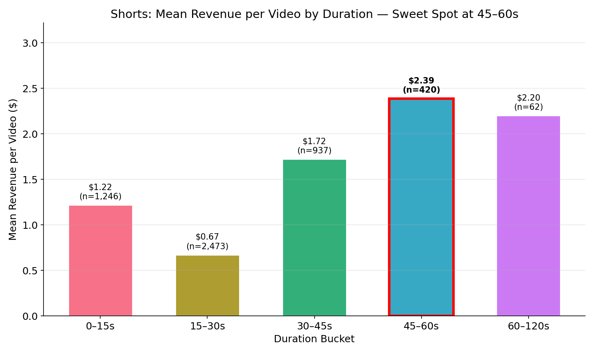

---

# Инсайт 1: Оптимальная длительность для Production

Для обычных видео есть чёткая «зона максимальной отдачи» — 8-15 минут. На отметке 8 минут YouTube включает mid-roll рекламу, и CPM резко растёт.

| Длительность | Доля контента | Доля выручки YouTube | Эффективность |
|:------------:|:-------------:|:--------------------:|:-------------:|
| 0-1 мин (Shorts) | 76.3% | 28.1% | 0.4x |
| 8-10 мин | 0.7% | 8.2% | **12.4x** |
| 10-15 мин | 2.0% | 20.5% | **10.5x** |
| 15-30 мин | 12.4% | 27.3% | 2.2x |

0.7% контента длиной 8-10 минут ассоциируется с 12.4× эффективностью по сравнению со средним.

⚠️ *Причинно-следственная связь:* формат 8-10 мин совпадает с порогом mid-roll рекламы YouTube (с 8 минут платформа разрешает рекламу в середине ролика — отсюда скачок CPM). Но есть и selection bias: опытные каналы намеренно целятся в 8-10 мин, и их контент может быть качественнее в целом. Разбиение на бакеты (8/10/15/30 мин) выбрано по индустриальным порогам YouTube, а не произвольно. Тем не менее, корреляция ≠ причинность — нужен A/B тест с контролем за каналом.

Выборка: 104 видео (<1%). Within-channel: 8-10 мин лучше только в 38% каналов (13 из 34).

### Рекомендация
Наращивать производство видео 8-15 минут — пока эта ниша занимает менее 3% контента, но даёт почти 30% выручки YouTube. Проверить гипотезу A/B тестом: те же каналы производят контент разной длительности.

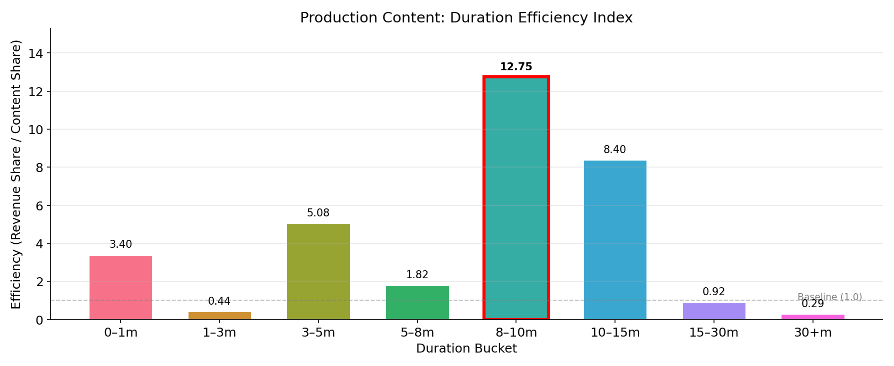

---

# Инсайт 2: Долгоживущий контент — это сложный процент

**Определение:** видео считается *долгоживущим (evergreen)*, если более 50% его просмотров приходят **после первого месяца** публикации. Такие видео не «выгорают», а продолжают стабильно набирать аудиторию.

10.8% видео попадают под это определение. Остальные «выгорают» за первые недели. Эти долгоживущие видео генерируют 44.3% всей отслеживаемой выручки.

**Сравнение:**

| Метрика | Долгоживущие (10.8% видео) | Обычные (89.2%) |
|---------|:--------------------------:|:---------------:|
| Средний доход | $10.56 | $1.61 |
| Доля выручки | 44.3% | 55.7% |
| Просмотры после 1-го месяца | 84% от всех | 6% |

84% просмотров долгоживущего контента приходят ПОСЛЕ первого месяца. Это буквально «сложный процент» в контенте — деньги продолжают приходить полгода и дольше.

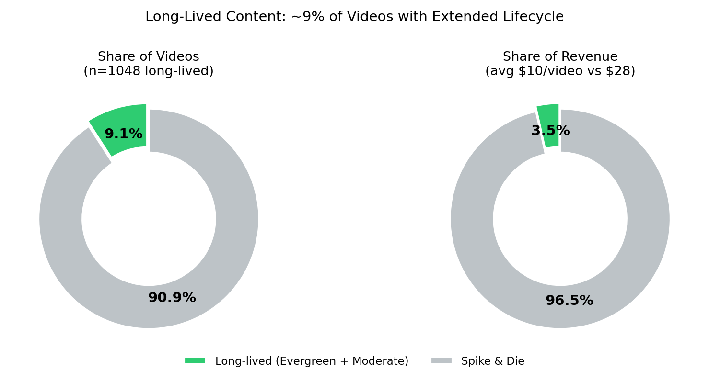

---

# Инсайт 2: Кластеры контента по жизненному циклу

K-Means кластеризация выявляет три типа контента:

| Кластер | Доля видео | Доля выручки | Просмотры после м.0 | Характеристика |
|---------|:----------:|:------------:|:-------------------:|----------------|
| Всплеск и затухание | 79.2% | 41.5% | 2.8% | Типичное видео: пик в первую неделю, потом тишина |
| Умеренное затухание | 12.4% | 25.2% | 36.3% | Постепенный спад, но поток сохраняется 2-3 месяца |
| Вечнозелёный | 8.5% | 33.3% | 91.4% | Стабильный приток просмотров 6+ месяцев |

8.5% «вечнозелёного» контента даёт треть всей выручки — и эта доля со временем только растёт, потому что такие видео продолжают набирать просмотры.

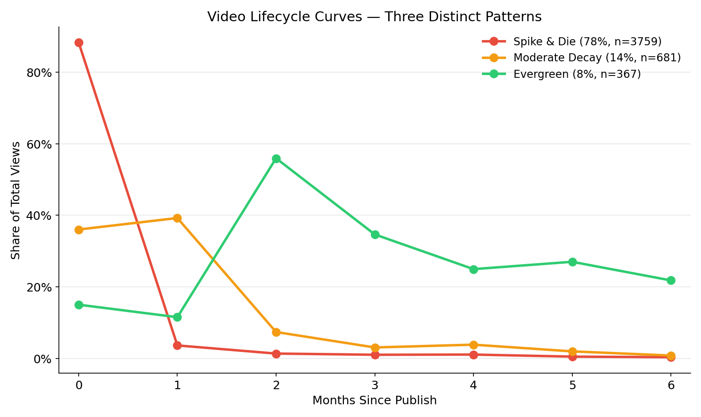

---

# Инсайт 2: ML-предиктор на 7-й день

Я обучил Gradient Boosting модель (8 признаков, доступных через 7 дней после публикации), которая предсказывает, станет ли видео долгоживущим.

**Качество (5-кратная кросс-валидация):** AUC = 0.87

**Выбор порога зависит от бизнес-задачи:**

| Порог | Точность | Полнота | Сколько видео отмечает |
|:-----:|:--------:|:-------:|:---------------------:|
| 0.1 | 50% | 69% | 837 |
| 0.2 | 61% | 63% | 615 |
| 0.3 | 67% | 59% | 535 |
| 0.5 | 75% | 54% | 431 |

Главный признак — доля просмотров, пришедших за первые 7 дней (66.6% важности). Если через неделю видео продолжает набирать просмотры — это почти наверняка долгоживущий контент.

**Практическое применение:** видео вышло 7 дней назад, модель оценивает вероятность 0.7 → помечаем как кандидата в вечнозелёный контент → запускаем продвижение.

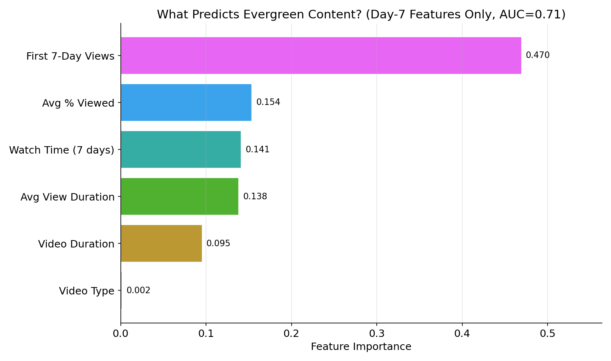

---

# Инсайт 2: Чего не хватает для полной картины

Модель определяет КАНДИДАТОВ на продвижение. Но чтобы понять, работает ли продвижение, нужны данные, которых нет в текущих датасетах:

**Что нужно для следующего шага:**
- Данные о расходах на продвижение каждого видео — чтобы посчитать реальный ROI
- Разделение органического и платного трафика
- A/B тест: продвигать отмеченные моделью видео vs контрольная группа, 4 недели, замерить прирост выручки

**Предлагаемая метрика:** Evergreen Score = просмотры 3-го месяца / просмотры 1-го месяца. Цель: увеличить долю вечнозелёного контента с 8.5% до 15%.

---

# Инсайт 3: Кросс-платформенная публикация ассоциируется с удвоением просмотров

96% контента публикуется только на одной платформе. Те 4%, которые выходят на нескольких площадках, показывают радикально больше просмотров.

**Рост просмотров при публикации на нескольких площадках:**

| Платформа | Одна площадка | Несколько площадок | Рост | p-value |
|-----------|:-------------:|:------------------:|:----:|:-------:|
| Facebook | 63 736 | 127 373 | **+100%** | < 0.0001 |
| Snapchat | 927 574 | 2 172 797 | **+134%** | < 0.0001 |
| YouTube | 12 131 | 5 395 | -56% | 0.18 (не значимо) |

Это не каннибализация: аудитории Facebook и Snapchat почти не пересекаются. Публикация того же контента на второй площадке привлекает новых зрителей, а не перетягивает существующих.

Эффект не работает для YouTube — вероятно, потому что YouTube-алгоритм самостоятельно определяет, кому показывать видео, и дополнительный трафик с других платформ не влияет на ранжирование.

⚠️ Selection bias: кросс-постнутые видео изначально имеют 3.2× больше просмотров. Within-channel: эффект подтверждается только в 37% каналов (21 из 57).

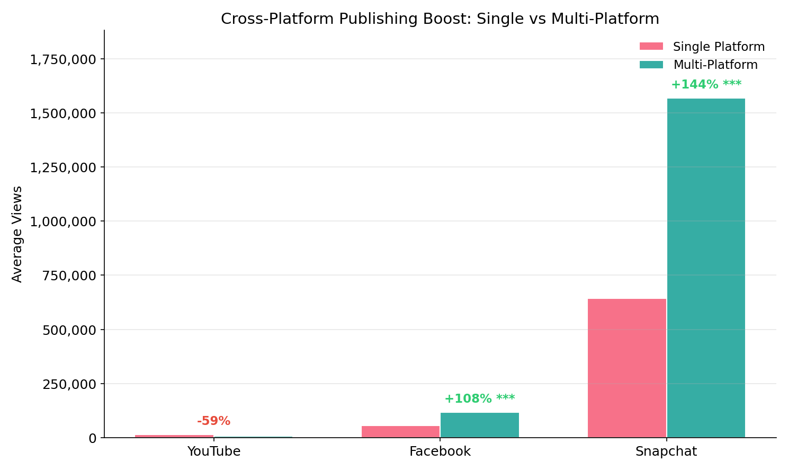

---

# Инсайт 3: Лучшие комбинации платформ

**Facebook + Snapchat** — самая выгодная пара: средняя совокупная выручка $2 671 за единицу контента (238 примеров).

Средний интервал между первой и второй публикацией — 87 дней. Это отложенная публикация, не одновременная.

### Рекомендация

1. Масштабировать кросс-постинг с 4% до 20% контента
2. Начать с пилота: 4% → 10%, фокус на связке Facebook + Snapchat
3. Замерить прирост просмотров и выручки, рассчитать ROI дополнительных затрат на адаптацию
4. Далее — A/B тест для подтверждения причинно-следственной связи (корреляция != причинность)

---

# Инсайт 4: Вовлечённость не равна выручке

Вовлечённость (лайки, комментарии, процент досмотра) — метрика, которую команды контента обычно оптимизируют. В данных TheSoul она отрицательно связана с выручкой.

**Ранговые корреляции с выручкой (Spearman):**

| Метрика | Корреляция | Интерпретация |
|---------|:----------:|---------------|
| Время просмотра | +0.65 | Лучший предиктор выручки |
| Количество просмотров | +0.62 | Сильная связь |
| Лайки | +0.45 | Умеренная |
| Репосты | +0.41 | Умеренная (распространяет контент) |
| Комментарии | +0.29 | Слабая |
| Вовлечённость (engagement rate) | **-0.24** | Отрицательная |
| Процент досмотра | **-0.39** | Отрицательная |

Из видео с топ-25% по вовлечённости только 13.4% попадают в топ-25% по выручке. Это хуже случайного угадывания (25%).

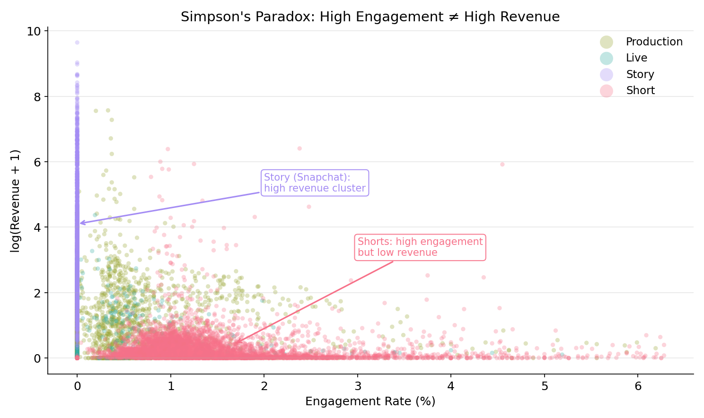

---

# Инсайт 4: Почему так происходит

Это классический парадокс Симпсона. Вот механизм:

1. **Shorts имеют высочайшую вовлечённость:** зрители пересматривают 15-секундный ролик (retention 105%), ставят лайки. Engagement rate = 1.41.
2. **Shorts почти не приносят денег:** CPM = $0.06, средняя выручка = $1.27.
3. **Production видео — наоборот:** низкая вовлечённость (retention 20%, engagement = 1.27), но CPM = $1.94, выручка = $9.68.

Когда мы смешиваем форматы, высокая вовлечённость = «скорее всего это Short» = низкая выручка.

**Внутри одного формата парадокс исчезает.** Среди Production-видео вовлечённость слабо положительно коррелирует с выручкой (ρ = +0.16). Антикорреляция — целиком эффект смешивания форматов.

### Рекомендация
1. Заменить engagement rate на время просмотра (watch time) как главную метрику в дашбордах
2. Не сравнивать вовлечённость между Shorts и Production — это разные вселенные
3. Из метрик вовлечённости следить за репостами — единственная метрика, связанная с распространением и доходом

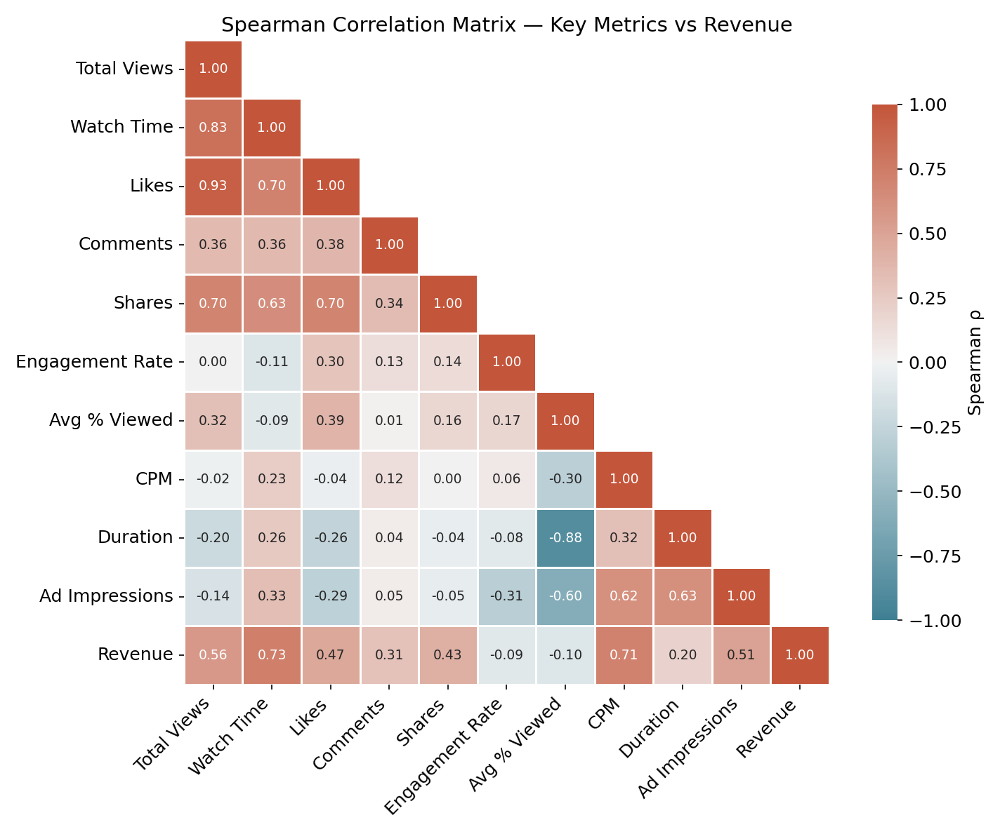

---

# Инсайт 5: Концентрация выручки на Snapchat

Почти половина всей выручки Snapchat приходит с одного канала.

**Топ-5 каналов Snapchat:**

| Канал | Выручка | Доля | Видео |
|-------|--------:|:----:|:-----:|
| channel_621 | $131 291 | 46.4% | 94 |
| channel_761 | $30 723 | 10.9% | 43 |
| channel_1367 | $21 559 | 7.6% | 44 |
| channel_438 | $12 507 | 4.4% | 46 |
| channel_190 | $9 004 | 3.2% | 41 |
| Остальные 27 | $77 724 | 27.5% | — |

Индекс Джини = 0.73 — высокая концентрация.

### Рекомендация
1. Мониторинг channel_621 — если просядет, компания потеряет почти половину выручки Snapchat
2. Извлечь практики топ-5 каналов и масштабировать на остальные
3. Долгосрочная цель: ни один канал не даёт больше 25% выручки платформы

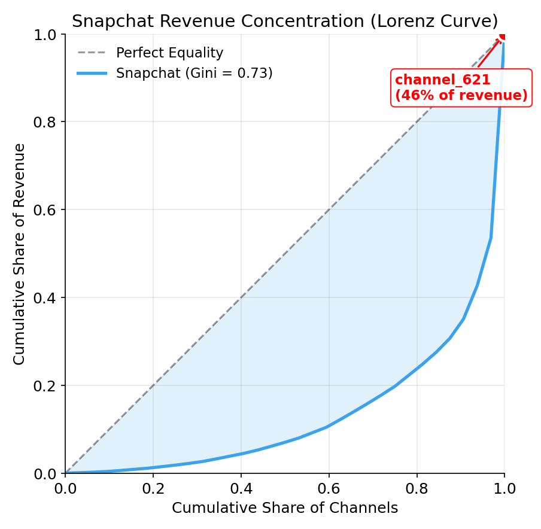

---

# Инсайт 6: Топ-практики каналов

Из 83 каналов (≥10 видео). Топ-10 по revenue/video — **все Snapchat** (объём просмотров). Для YouTube (управляемая платформа) — отдельный анализ.

**YouTube: топ-10 vs bottom-10**

| Метрика | YT Топ-10 | YT Bottom-10 | Разница |
|---------|:---------:|:------------:|:-------:|
| Revenue/video | $13.54 | $0.10 | 130.5x |
| CPM | $1.93 | $0.11 | 17.3x |
| Watch time | 158,232 мин | 14,078 мин | 11.2x |
| Доля Shorts | 25.5% | 80.4% | — |
| Доля Production | 63.2% | 18.2% | — |
| Evergreen rate | 14.9% | 21.3% | — |
| Видео/месяц | 21.8 | 58.7 | — |

**Ключевой вывод:** формат-микс (доля Production) определяет revenue, а не частота публикации. Топ-каналы публикуют реже (21.8 vs 58.7 видео/мес), но это следствие выбора формата — Production занимает больше времени на производство. Разница в 130× по revenue/video объясняется CPM (17.3×) и watch time (11.2×), а не «качеством» отдельных роликов.

**Snapchat:** channel_621 даёт 46% выручки Snapchat ($1,396.71/video). Все топ-10 — Story-каналы с масштабом просмотров.

### Рекомендация
1. **YouTube:** перенести формат-микс топ-каналов (63% Production) на отстающие каналы
2. **YouTube:** увеличить долю Production 8-15 мин на каналах с низким CPM
3. **Snapchat:** изучить и масштабировать модель channel_621
4. **Все платформы:** каналы с <$0.10 rev/video — аудит или консолидация

---

# ⚠️ Методологические оговорки

Все выводы в этой презентации основаны на **наблюдательных данных** (observational data). Корреляции ≠ причинно-следственные связи.

**Основные риски:**
- **Selection bias:** для кросс-постинга и длинных форматов могут выбирать изначально лучший контент
- **Channel confounding:** успешные каналы одновременно делают длинные видео И имеют лояльную аудиторию
- **Survivorship bias:** анализируем только активные каналы, не видим закрытые

**Для подтверждения причинно-следственных связей:**
1. **A/B тесты** — случайно назначать формат/длительность/кросс-постинг и замерять эффект
2. **Propensity score matching** — подобрать «похожие» видео разных форматов для fair comparison
3. **Difference-in-differences** — сравнить каналы до и после смены стратегии

Рекомендации презентации — это гипотезы для проверки, а не доказанные факты.

---

# План действий

**Эта неделя:**
1. Заменить engagement rate на watch time в дашбордах
2. Запустить 7-дневный ML-скоринг видео на предмет долгоживущего контента
3. Начать трекать долю кросс-постинга как операционную метрику (сейчас 4%)

**1-3 месяца:**
4. Увеличить долю Shorts формата 45-60 секунд, усилить воскресные публикации
5. Масштабировать кросс-постинг Facebook + Snapchat до 10%, замерить эффект
6. Ввести метрику Evergreen Score для оценки качества контента

**3-6 месяцев:**
7. A/B тест ML-продвижения: модель отмечает видео vs контрольная группа
8. Снизить концентрацию выручки Snapchat — не более 25% на один канал
9. Тест гипотезы: ручной SMM vs автопостинг на 250+ каналах

---

# Что дальше

## Гипотеза о SMM: человек или автоматизация?

TheSoul управляет 250+ каналами. Ключевой вопрос: даёт ли ручная работа SMM-менеджера (превью, заголовки, описания) значимый прирост к выручке — или можно автоматизировать?

**Как проверить:** разметить видео по методу публикации, уравнять группы по характеристикам контента (propensity score matching), провести A/B тест на 4 недели. Если прирост CPM от ручного SMM > 15% — ROI на команду очевиден. Если < 5% — автоматизация высвободит ресурсы.

## От разового анализа к постоянному мониторингу

Этот анализ — разовый срез. В продакшене это автоматический pipeline: ML-скоринг на 7-й день, алерты в Slack, мониторинг аномалий CPM, еженедельные отчёты. MVP — 2 недели, полная система — 2-3 месяца.

## Какие данные запросить
- Расходы на продвижение каждого видео (для расчёта ROI)
- Разметка SMM-метода: ручной vs автопостинг
- Демографика аудитории (для анализа контент × аудитория)
- Оценки стоимости производства (для валидации ROI-анализа Shorts)

---

*Дмитрий Протасов | TheSoul Group | Март 2026*
